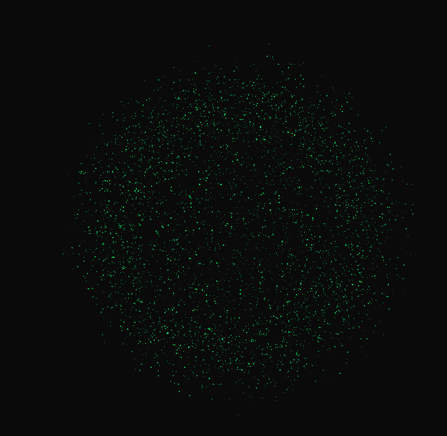

# SKYNET - Assistente Pessoal com IA Local

<div align="center">



[](https://python.org)
[](https://ollama.com)
[](https://threejs.org)
[](https://fastapi.tiangolo.com)
[](LICENSE)

Um assistente pessoal inteligente para PC com IA 100% local e visualização 3D interativa

[Instalação](#-instalação) •
[Funcionalidades](#funcionalidades) •
[Uso](#como-usar) •
[Comandos](#comandos-de-voz) •
[Tecnologias](#tecnologias)

</div>

---

## Sobre o Projeto

Skynet é um assistente pessoal para PC que combina:
- **IA 100% Local com Ollama** - Gratuito, privado, sem API keys
- Reconhecimento de voz com Whisper (processamento local)
- Síntese de voz natural com Edge TTS
- Controle do sistema (abrir apps, executar comandos, pesquisar na web)
- Visualização 3D interativa com sistema de partículas
- **Suporte a CPU, NVIDIA (CUDA) e AMD (DirectML)**


---

## Funcionalidades

### 🤖 Inteligência Artificial Local (Ollama)
- **100% Gratuito** - Sem custos de API
- **100% Privado** - Dados nunca saem do seu PC
- **Offline** - Funciona sem internet após instalação
- Modelos de alta qualidade (Llama 3.2, Mistral, etc.)
- Suporte a GPU: NVIDIA (CUDA) e AMD (DirectML)

### 🎤 Reconhecimento de Voz (Speech-to-Text)
- Modelo OpenAI Whisper rodando localmente
- Aceleração GPU (NVIDIA/AMD)
- 100% offline após download do modelo
- Suporte a português brasileiro
- Ignora ruídos de fundo

### 🔊 Síntese de Voz (Text-to-Speech)
- Edge TTS - Vozes neurais da Microsoft (qualidade premium)
- Fallback para pyttsx3 (offline)
- Voz em português brasileiro

### 💻 Controle do Sistema
| Comando | Ação |
|---------|------|
| Abrir aplicativos | Chrome, VS Code, Spotify, etc. |
| Fechar aplicativos | Encerra processos |
| Pesquisar na web | Abre busca no Google |
| Executar comandos | CMD/PowerShell |
| Controlar volume | Aumentar, diminuir, mudo |
| Screenshot | Captura de tela |
| Digitar texto | Automação de teclado |

### 🧠 Sistema de Memória
- Curto prazo: Histórico da conversa atual
- Longo prazo: Banco SQLite com preferências
- Extração automática de informações do usuário

### ✨ Visualização 3D
Sistema de partículas interativo com múltiplos modos:
- **Esfera** - Partículas em formação esférica densa
- **Átomo** - Órbitas atômicas
- **Fogos** - Explosão de partículas
- **Onda** - Ondulação suave
- **Hélice** - Estrutura de DNA
- **Galáxia** - Braços espirais

**Animação de Introdução:** Ao iniciar, a esfera se transforma no texto "SKYNET" e depois volta à forma esférica!

---

## Instalação

### Pré-requisitos
- Python 3.10 ou superior
- Windows 10/11
- **Ollama** (IA Local) - https://ollama.com/download

### Instalação Rápida (Windows)

```bash
# 1. Clone o repositório
git clone https://github.com/ThyagoToledo/SkyNet.git
cd SkyNet

# 2. Execute o instalador
install.bat

# 3. Instale o Ollama
# Baixe de: https://ollama.com/download

# 4. Baixe o modelo de IA
ollama pull llama3.2
```

### Instalação Manual

```bash
# 1. Criar ambiente virtual
python -m venv venv
.\venv\Scripts\activate

# 2. Instalar dependências
pip install -r requirements.txt

# 3. Instalar PyAudio (Windows)
pip install pipwin
pipwin install pyaudio

# 4. Instalar Ollama (separadamente)
# Baixe de: https://ollama.com/download
# Depois execute: ollama pull llama3.2
```

### Configuração

1. Copie o arquivo de exemplo:
```bash
copy .env.example .env
```

2. (Opcional) Edite `.env` para personalizar:
```env
OLLAMA_MODEL=llama3.2
ASSISTANT_NAME=Skynet
```

> **Não é necessária nenhuma API Key!** A IA roda 100% local.

---

## Como Usar

### Iniciar o Assistente

**Modo Desktop (Recomendado):**
```bash
start_desktop.bat
```

**Modo Web (Navegador):**
```bash
start.bat
# Depois abra: http://localhost:8000
```

### Seleção de Hardware

Ao iniciar, você será perguntado sobre qual hardware usar:
```
╔══════════════════════════════════════════════════════════════╗
║           SKYNET - Seleção de Hardware para IA               ║
╠══════════════════════════════════════════════════════════════╣
║  [1] CPU (funciona em qualquer PC)                           ║
║  [2] NVIDIA GPU - GeForce RTX 3080                           ║
║  [3] AMD GPU - Radeon RX 6800                                ║
╚══════════════════════════════════════════════════════════════╝
```

### Interação

1. **Por voz:** Clique no botão de voz 🎤 ou diga "Skynet"
2. **Por texto:** Digite na caixa de mensagem
3. **Modos visuais:** Clique nos botões à direita
4. **Configurações:** Clique no ⚙️ para ajustar áudio

---

## Comandos de Voz

### Aplicativos
```
"Abrir Chrome"
"Abrir VS Code"
"Abrir Spotify"
"Fechar navegador"
```

### Pesquisa
```
"Pesquisar clima em São Paulo"
"Buscar notícias sobre tecnologia"
```

### Sistema
```
"Volume aumentar"
"Volume diminuir"
"Tirar screenshot"
"Executar comando dir"
```

### Conversa
```
"Olá, como você está?"
"Me conte uma piada"
"Qual a capital do Brasil?"
```

---

## Estrutura do Projeto

```
skynet/
├── 📄 main.py                    # Entrada principal (web)
├── 📄 desktop_app.py             # Aplicação desktop
├── 📄 requirements.txt           # Dependências
├── 📄 .env                       # Configurações (criar)
│
├── 📁 src/
│   ├── 📁 core/
│   │   ├── assistant.py          # Orquestrador
│   │   └── hardware_selector.py  # Seleção CPU/GPU
│   ├── 📁 speech/
│   │   ├── speech_to_text.py     # Whisper STT
│   │   └── text_to_speech.py     # Edge TTS
│   ├── 📁 ai/
│   │   └── ollama_client.py      # Cliente Ollama (IA Local)
│   ├── 📁 system/
│   │   └── system_controller.py  # Controle PC
│   ├── 📁 memory/
│   │   └── memory_manager.py     # SQLite
│   └── 📁 server/
│       └── websocket_server.py   # FastAPI
│
├── 📁 frontend/
│   ├── index.html                # Interface
│   └── 📁 js/
│       ├── particles.js          # Three.js 3D
│       ├── websocket-client.js   # WebSocket
│       └── app.js                # App frontend
│
└── 📁 data/
    └── memory.db                 # Banco de dados
```

---

## Tecnologias

### Backend
| Tecnologia | Uso |
|------------|-----|
|  | Linguagem principal |
|  | IA local |
|  | Servidor web |
|  | Reconhecimento de voz |
|  | Banco de dados |

### Frontend
| Tecnologia | Uso |
|------------|-----|
|  | Visualização 3D |
|  | Lógica frontend |
|  | Tempo real |

---

## Configurações

### Variáveis de Ambiente (.env)

```env
# Configurações do Ollama (IA Local)
OLLAMA_MODEL=llama3.2
OLLAMA_HOST=http://localhost:11434

# Configurações do assistente
ASSISTANT_NAME=Skynet
ASSISTANT_VOICE=pt-BR-FranciscaNeural
WAKE_WORD=skynet

# Reconhecimento de voz
WHISPER_MODEL=small    # tiny, small, medium, large
LANGUAGE=pt

# Servidor
SERVER_HOST=localhost
SERVER_PORT=8000

# Memória
MAX_CONVERSATION_HISTORY=20
MEMORY_DB_PATH=./data/memory.db
```

---

## Contribuindo

Contribuições são bem-vindas! 

1. Fork o projeto
2. Crie sua branch (git checkout -b feature/NovaFeature)
3. Commit suas mudanças (git commit -m 'Add NovaFeature')
4. Push para a branch (git push origin feature/NovaFeature)
5. Abra um Pull Request

---

## Licença

Este projeto está sob a licença MIT. Veja o arquivo [LICENSE](LICENSE) para mais detalhes.

---

## Agradecimentos

- [Ollama](https://ollama.com/) - IA local gratuita
- [OpenAI Whisper](https://github.com/openai/whisper) - Reconhecimento de voz
- [Three.js](https://threejs.org/) - Gráficos 3D
- [FastAPI](https://fastapi.tiangolo.com/) - Framework web

---

<div align="center">

Feito com ❤️ e ☕

⭐ Deixe uma estrela se este projeto ajudou!

</div>
